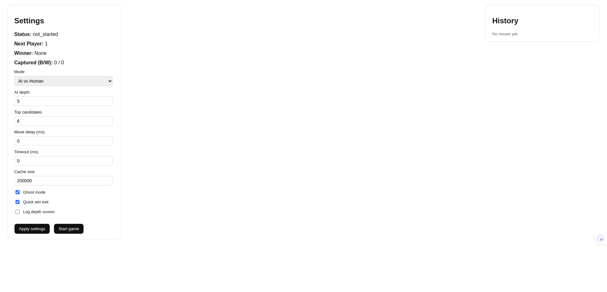

# Frontend Feature Inventory (Current Version)

This document captures the features currently implemented in the existing frontend so they can be rebuilt in the next version.

## Reference screenshot

## Core UI structure

- 3-column layout:
  - **Left:** Settings panel
  - **Center:** Game board panel
  - **Right:** Move history panel
- Full-height single-page app layout with internal panel scrolling.

## Data loading and live sync

- Initial REST fetches on load:
  - `GET /api/ping` (health check fetched, not currently displayed in UI)
  - `GET /api/status` (initial game state)
- Live updates through WebSocket `\`/ws/\``:
  - Handles message types: `status`, `history`, `reset`, `settings`
  - Sends `request_status` when socket opens.
- Optional ghost WebSocket `\`/ws/ghost\``:
  - Opened only when `ghost_mode` is enabled
  - Closed automatically when `ghost_mode` is disabled.

## Settings panel features

### Game state display

- Current game status (`not_started` / `running` / etc.)
- Next player indicator
- Winner indicator
- Captures summary: Black / White

### Play mode controls

- Mode selector with 3 options:
  - `AI vs AI`
  - `AI vs Human`
  - `Human vs Human`
- Mode selector is disabled while a game is running.

### AI and engine configuration controls

- Numeric inputs:
  - AI depth (`ai_depth`)
  - Top candidates (`ai_top_candidates`)
  - Move delay in ms (`ai_move_delay_ms`)
  - Timeout in ms (`ai_timeout_ms`)
  - Transposition/cache size (`ai_tt_max_entries`)
- Toggle checkboxes:
  - Ghost mode (`ghost_mode`)
  - Quick win exit (`ai_quick_win_exit`)
  - Log depth scores (`log_depth_scores`)
- "Apply settings" button posts current settings/config to backend.

### Game control actions

- "Start game" button (when not running)
- "Stop game" button (when running)
- Busy/disabled states with dynamic labels:
  - `Starting...`, `Stopping...`, `Saving...`

## Board features

- Board is reconstructed from move history data.
- Supports dynamic board size from backend (`board_size`, default 19).
- Responsive cell sizing using `ResizeObserver` to fit available panel space.
- Click-to-play interaction:
  - Only empty cells are playable
  - Only playable when game is running, no winner, and it is a human turn
  - In `AI vs Human`, only player 1 (human side) can click.
- Board colors by player:
  - Player 1 (black side data-wise)
  - Player 2 (white side)

## History panel features

- Scrollable move list.
- Empty state text: `No moves yet.`
- Per-move details shown:
  - Player badge (`B`/`W`)
  - Coordinates `(x, y)`
  - Move elapsed time (formatted ms/s/min/h)
  - Move source tag (`AI` or `Human`)
  - Capture delta badge when captures happen (`+N`)

## State and update behavior

- Local busy flags prevent duplicate actions during API requests.
- Incremental board updates supported via `history` message `changes` payload.
- Full board rebuilds supported for status/reset refresh paths.
- Captured totals are recomputed from history entries (`captured_count`).

## Backend endpoints currently used by frontend

- `GET /api/ping`
- `GET /api/status`
- `POST /api/start`
- `POST /api/stop`
- `POST /api/settings`
- `POST /api/move`
- `WS /ws/`
- `WS /ws/ghost`
